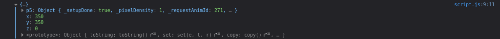
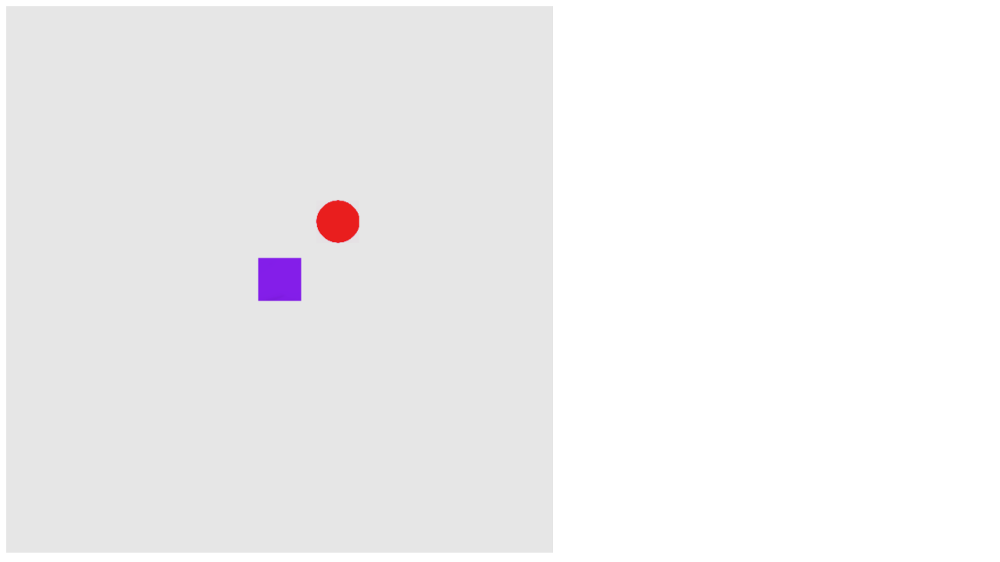

# Introdução

Muitas vezes, imaginamos que para criar jogos, é necessário usar *engines* (motores gráficos) super pesados e feitos especialmente para isso. Como Unity e Unreal. Mas não. Podemos criar jogos simples de navegador, usando unicamente Javascript.

Estes jogos podem tanto ser feitos com Javascript puro, ou também usando alguma biblioteca criada para criar jogos, que será o nosso caso. Usando alguma biblioteca para isso todo o processo é facilitado, pois detalhes como a colisão entre os elementos do jogo podem ser feitas mais rapidamente, sem o uso de um cálculo para isso por exemplo.

# P5.play

A biblioteca que vamos usar será a **P5.play**, uma biblioteca de Javascript criada para jogos. A P5.play usa por baixo dos panos a **P5.js**.

A P5.js é uma biblioteca para a criação de gráficos. Não precisamos saber nada da P5.js para começarmos a criar os jogos com a P5.play.

- Para usarmos a P5.play em uma página, é bem simples, primeiro precisaremos criar uma pasta chamada `lib/` para guardar todos os arquivos dessas bibliotecas.

- Primeiro, baixe a P5.js, de preferência pelo [arquivo minificado](https://github.com/processing/p5.js/releases/download/1.2.0/p5.min.js), ou caso você queira mais opções de download, você também pode acessar [a página de download da P5.js](https://p5js.org/download/)

- Depois, precisamos baixar os arquivos da P5.play. Você pode tanto clonar os arquivos [do repositório do Github da P5.play](https://github.com/molleindustria/p5.play), ou também [baixar o arquivo comprimido do repositório](https://github.com/molleindustria/p5.play/archive/master.zip)

Garanta que todos estes arquivos estão dentro da pasta `lib/`. Ela deve ficar dessa forma:

```
p5.min.js  p5.play/
```

# Codificando a base do projeto

Crie um arquivo HTML na raiz do seu projeto, como por exemplo, `index.html` e insira isso dentro do arquivo:

```html
<!DOCTYPE html>
<html lang="en">
  <head>
    <meta charset="UTF-8" />
    <meta name="viewport" content="width=device-width, initial-scale=1.0" />
    <title>Jogo feito com P5.js</title>
    <script src="lib/p5.min.js"></script>
    <script src="lib/p5.play/lib/p5.play.js"></script>
  </head>
  <body>
    <script src="script.js"></script>
  </body>
</html>
```

Neste arquivo, importamos tanto P5.js, quanto P5.play, e também um arquivo chamado `script.js`, onde estará toda a lógica do nosso jogo.

Dentro do P5.play há duas funções que precisamos obrigatoriamente criar no nosso código, a função `setup` e a função `draw`

Setup será a função que criará o canvas do jogo, essa função irá preencher os primeiros elementos dentro do canvas. A função setup **é executada uma única vez.**

Draw será a função que irá preencher o canvas após o setup, mas de maneira contínua, que é 60 vezes por segundo. Logo, **é executada várias vezes, não só uma.**

Por enquanto, tentaremos fazer um jogo simples. Um jogo onde temos um quadrado no meio da tela, que conseguimos mover usando o teclado. E que terão bolinhas que podem colidir com esse quadrado. E se caso colidirem, o jogo será perdido e reiniciado.

# Codificando o jogo dentro da P5.play 

Crie um arquivo chamado `script.js`, dentro desse arquivo iremos colocar a lógica do jogo, dentro das funções `setup` e `draw`

Neste arquivo, o objetivo será criar um quadrado na tela dentro da função `setup`, e possibilitar que quem está jogando, use as teclas WASD para mover o quadrado pela tela.

Primeiramente vamos criar as duas funções, que podem facilmente ser escritas como funções normais:

```javascript
function setup(){
  // código da função setup
}

function draw(){
  // código da função draw
}
```

## Criando o Canvas

Agora, dentro da função `setup` precisamos primeiramente criar o canvas que armazenará todos os elementos do jogo. Podemos fazer isso com a função `createCanvas(comprimento, altura)`, colocando o comprimento e a altura em pixels.

E também precisamos pintar o canvas dentro da função `draw`. Pois essa pintura deve ser feita a cada frame, garantindo que tudo que poderia ter aparecido antes na tela, seja removido, e sobreescrito por um novo conteúdo. Mais para frente você verá um exemplo prático disso. A função que usaremos será a `background(cor)`, e esta `cor` deve ser um número entre 0 e 256. Você pode [acessar esse site](https://jonasjacek.github.io/colors/) para ver essas 255 cores que você pode usar dentro da função `background`.

O código que devemos fazer é este:

```javascript
function setup(){
  createCanvas(700, 700)
}

function draw(){
  background(230)
}
```

Neste caso, estamos criando um canvas de 700 por 700 pixeis, e preenchendo com a cor 230 que é um cinza.


## Adicionando o quadrado na tela

Agora precisamos criar o quadrado na tela. Para isso, precisaremos criar um sprite, e atribuir uma imagem a esse sprite, que no caso é uma imagem de um quadrado ou até mesmo qualquer imagem. Isso vai ser feito na função `setup`

Depois disso, precisaremos criar as regras que irão controlar a movimentação do quadrado, sobre o quê cada tecla vai fazer, e o quanto que o quadrado vai se movimentar nessa ação.

Primeiro teremos que criar uma variável global, que deve estar normalmente acima das funções setup e draw, que irá armazenar tudo sobre esse quadrado, como por exemplo, o nome `square`. 

```javascript

var square; // criação do quadrado de forma global

function setup(){
  // código da função setup já preenchido
}

function draw(){
  // código da função draw já preenchido
}
```

Dentro da função `setup`, teremos que adicionar no final estas três linhas:

```javascript
  square = createSprite(450, 450)
  squareImg = loadImage('https://raw.githubusercontent.com/edersonferreira/criando-jogos-com-js-e-p5/main/assets/square.png')
  square.addImage(squareImg)
```

- A primeira linha cria o sprite do quadrado, nas posições 450 X e 450 Y, que seria o meio da tela.
- A segunda linha carrega uma imagem externa, que é uma [imagem de quadrado](https://raw.githubusercontent.com/edersonferreira/criando-jogos-com-js-e-p5/main/src/assets/square.png) que está no [repositório do github que guarda os arquivos desse artigo](https://github.com/edersonferreira/criando-jogos-com-js-e-p5)
- A terceira linha usa a variável `squareImg` que contém a imagem carregada, adicionando essa imagem ao sprite. Assim criando o quadrado na tela.

Caso você tenha se perdido, a função `setup` e a parte de cima do código deve estar assim:

```javascript
var square

function setup(){
  createCanvas(700, 700)
  square = createSprite(350, 350)
  squareImg = loadImage('https://raw.githubusercontent.com/edersonferreira/criando-jogos-com-js-e-p5/main/src/assets/square.png')
  square.addImage(squareImg)
}
```

Agora dentro da função `draw` devemos apenas adicionar uma linha abaixo, que chama a função `drawSprites()`, que é a função que irá desenhar os sprites na tela.

Assim, a função `draw` com a adicão do `drawSprites()` deve ficar assim:

```javascript
function draw(){
  background(230)
  drawSprites()
}
```

Com isso, o nosso jogo ficará assim:


## Dando vida ao nosso quadrado!

Agora vamos fazer o nosso quadrado se movimentar com WASD, que será bem simples.

a P5.play fornece para nós, uma função já criada chamada `KeyDown(tecla)`, que retornará `true` se essa tecla foi pressionada, e `false` se a tecla não foi pressionada. Apenas precisamos criar condições para cada tecla (WASD), e se esse resultado da `keyDown()` for verdadeiro, mudar a posição do quadrado.

Isso deve ser feito dentro da função `draw`, pois é algo que deve ser feito repetidas vezes, especificadamente uma vez por frame.

Juntando a função `keyDown()` com uma condicional, ficará algo assim:

```javascript
if (keyDown('W')){

}
```

Agora precisamos preencher essa função com o método que vamos usar para mover o quadrado. Dentro da P5.play, podemos usar `square.position` para pegar tanto o X quanto o Y, para demonstrar isso, vamos dentro da função setup, criar uma linha apenas para teste, fazendo um console.log dentro de `square.position`.

```javascript
function setup(){
  createCanvas(700, 700)
  square = createSprite(350, 350)
  squareImg = loadImage('https://raw.githubusercontent.com/edersonferreira/criando-jogos-com-js-e-p5/main/src/assets/square.png')
  square.addImage(squareImg)

  // novo código
  console.log(square.position)
}
```

Com isso, quando o sprite é criado, será logado no console as suas posições.

Caso você abra o console, verá isso:



Estas são as exatas posições X e Y do quadrado, que podemos mudar de modo simples, pois se queremos acessar por exemplo, o eixo X do quadrado podemos fazer `square.position.x`

> Você já pode remover o `console.log` que usamos para ver essa informação.

Agora podemos mudar a condição feita anteriormente, decrementando o Y do quadrado, pois W será a tecla que vai mandar o quadrado para cima:

```javascript
if (keyDown('W')){
  square.position.y -= 5
}
```

Você pode podar esta decrementação por um outro valor, 5 é apenas um valor para exemplo.

Agora, se você apertar ou segurar a tecla W no jogo, o seu quadrado irá para cima!

Agora podemos criar isso para todas as outras teclas, seguindo a exata mesma lógica, apenas mudando de Y para X

```javascript
  if (keyDown('W')){
    square.position.y -= 5
  }
  if (keyDown('S')){
    square.position.y += 5
  }
  if (keyDown('A')){
    square.position.x -= 5
  }
  if (keyDown('D')){
    square.position.x += 5
  }
```

Agora podemos usar as teclas WASD para livremente mover pelo canvas!

Relembrando que a função `draw` ao final ficará assim:

```javascript
function draw(){
  background(230)

  if (keyDown('W')){
    square.position.y -= 5
  }
  if (keyDown('S')){
    square.position.y += 5
  }
  if (keyDown('A')){
    square.position.x -= 5
  }
  if (keyDown('D')){
    square.position.x += 5
  }

  drawSprites()
}
```

## Adicionando dificuldade

Agora vamos adicionar um elemento de dificuldade no jogo. Vamos adicionar bolinhas que aparecem das bordas do canvas, e voam até o quadrado. E se essas bolinhas acertarem o quadrado, o jogo é perdido e a página é recarregada para uma nova partida.

Podemos usar a função `setInterval` que vem no Javascript puro. Essa função vai permitir colocarmos um trecho de código, que será repetido em um intervalo que podemos personalizar.

Como queremos que essa chamada do `setInterval` seja feita uma única vez, podemos fazer isso dentro da função `setup` para ser executada uma única vez.

Com isso, vamos adicionar á `setup` a `setInterval` que precisamos, e criar a variável `circle` sendo global:

```javascript
var square;
var circle; // novo código

function setup(){
  createCanvas(700, 700)
  square = createSprite(350, 350)
  squareImg = loadImage('https://raw.githubusercontent.com/edersonferreira/criando-jogos-com-js-e-p5/main/src/assets/square.png')
  square.addImage(squareImg)

  // novo código
  setInterval(createEnemy, 1500)
}
```

Agora, a função `createEnemy` será chamada a cada 1.5 segundos. Esse tempo você pode personalizar normalmente.

Junto com a `setInterval`, precisaremos criar também uma função que crie a bolinha, em uma posição aleatória (vamos supor 4, topo-direita, topo-esquerda, baixo-direita e baixo-esquerda).

No  caso, essa função é a `createEnemy`. Iremos usar o mesmo método que usamos para criar o quadrado. Mas com algumas adições:

```javascript
function createEnemy(){
  positions = [[700, 0], [0, 700], [700, 700], [0, 700]]
  positionRandom = positions[Math.floor(Math.random() * positions.length)];
  circle = createSprite(positionRandom[0], positionRandom[1])
  circleImg = loadImage('https://raw.githubusercontent.com/edersonferreira/criando-jogos-com-js-e-p5/main/src/assets/circle.png')
  circle.addImage(circleImg)
  circle.attractionPoint(13, square.position.x, square.position.y)
}
```

- Na primeira linha, criamos uma matriz (um vetor de vetores) com as posições possíveis da bolinha.
- Na segunda linha, pegamos um elemento aleatório dessa lista, não se preocupe com o método, isso pode ser pego facilmente em fóruns como [Stack Overflow](https://stackoverflow.com)
- Na terceira, criamos o sprite nessa posição X e Y que pegamos da `positionRandom`
- Na quarta, carregamos a imagem da bola diretamente do [Github do projeto](https://github.com/edersonferreira/criando-jogos-com-js-e-p5)
- Na quinta adicionamos essa imagem ao sprite
- E na sexta usamos um recurso da P5.play, chamado `attractionPoint`. Que cria um ponto onde a nossa bolinha será atraida

Agora abra a página, e veja o movimento que as bolinhas estão fazendo em direção ao quadrado:



Agora precisamos criar o sistema de colisão, que será bem simples, vamos apenas adicionar um [try...catch](https://developer.mozilla.org/en-US/docs/Web/JavaScript/Reference/Statements/try...catch), que é uma estrutura que conseguimos tratar os erros, mas neste caso, vamos fazer nada caso recebermos um erro. Isso apenas vai servir para evitar que o nosso jogo trave no browser.

```javascript
function draw(){
  background(230)

  // novo código

  try{
    square.collide(circle, finishGame)
  }catch(err){}

  // fim do novo código

  if (keyDown('W')){
    square.position.y -= 5
  }
  if (keyDown('S')){
    square.position.y += 5
  }
  if (keyDown('A')){
    square.position.x -= 5
  }
  if (keyDown('D')){
    square.position.x += 5
  }

  drawSprites()
}
```

Usamos para isso, um recurso da P5.play, chamado `collide`. Que retorna `true` caso o quadrado tenha se colidido com a bolinha, e `false` se não colidiu. E também podemos passar uma função como argumento, que será o quê vamos fazer caso essa colisão seja verdadeira. Essa função no caso é a `finishGame`.

A função `finishGame` irá remover o quadrado da tela, alertar na tela que o usuário perdeu, e recarregar a página. Dessa maneira:

```javascript
function finishGame(){
  square.remove()
  alert('Você Perdeu!')
  window.location.reload()
}
```

A única coisa que usamos fora do Javascript puro foi a função `remove()` da P5.play, que simplesmente remove um sprite da tela.

E pronto! agora temos um jogo totalmente funcional, onde somos um quadrado roxo, e devemos desviar de bolinhas vermelhas que tentam nos acertar!

# Desafios

Alguns desafios que seria recomendado de você cumprir para aumentar a sua compreensão, são:

- Criar um contador de quantas vezes que quem está jogando perdeu. Isso pode ser feito tanto com a P5.play (resetando a posição dos sprites) ou usando recursos do Javascript puro (como [LocalStorage](https://developer.mozilla.org/en-US/docs/Web/API/Window/localStorage))

- Criar bolinhas verdes que apareçam de tempos em tempos, e que se o quadrado colidir com alguma dessas bolinhas, incrementar seus pontos. Que serão resetados caso quem está jogando colida com uma bolinha vermelha.

# Links Importantes

[Site e Documentação Oficial da P5.play](http://molleindustria.github.io/p5.play/)

[Site e Documentação Oficial da P5.js](https://p5js.org/)

[Repositório do projeto que foi feito neste tutorial](https://github.com/edersonferreira/criando-jogos-com-js-e-p5)
